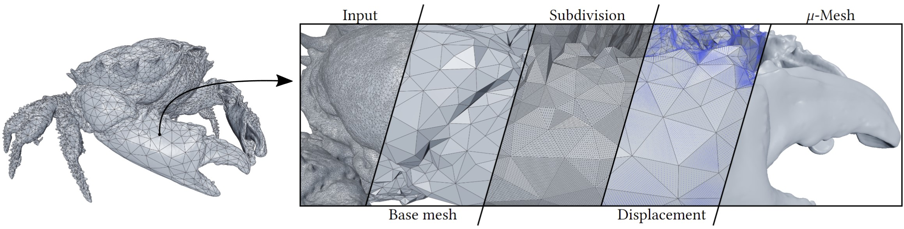

# Micromesh-construction



This repository provides the source code for the Siggraph 2023 paper [Micro-Mesh Construction](https://micromesh.di.unimi.it) by Andrea Maggiordomo, Henry Moreton and Marco Tarini.

### Summary

Micro-meshes are a new structured graphics primitive supporting a large
increase in geometric fidelity, without commensurate memory and run-time
processing costs, consisting of a base mesh enriched by a displacement
map. A new generation of GPUs supports this structure with native hardware
Micro-Mesh ray-tracing, that leverages a self-bounding, compressed
displacement mapping scheme to achieve these efficiencies. 

We present an automatic method to convert an existing multi-million
triangle mesh into this compact format, unlocking the advantages of the
data representation for a large number of scenarios. Our method is based
on a simplification scheme tailored to the generation of high-quality
_base meshes_, optimized for tessellation and displacement sampling,
in conjunction with algorithms for determining _displacement vectors_
to control the direction and range of displacements.

### Paper citation

```
@article{micromesh-construction,
  author = {Maggiordomo, Andrea and Moreton, Henry and Tarini, Marco},
  title = {Micro-Mesh Construction},
  year = {2023},
  issue_date = {August 2023},
  publisher = {Association for Computing Machinery},
  address = {New York, NY, USA},
  volume = {42},
  number = {4},
  issn = {0730-0301},
  doi = {10.1145/3592440},
  journal = {ACM Trans. Graph.},
  month = {jul},
  articleno = {121},
  numpages = {18}
}
```

### Building and running

This project has a few [external dependencies](ext/). To get them, either clone the repository and the submodules with `git clone --recurse-submodules ...`, or simply clone the repository and let CMake fetch the dependencies when configuring and generating build files.

**When building on Linux** there are additional dependencies on the X.org and GTK3 development libraries that must be installed before building GLFW and nativefiledialog. On Ubuntu 22.04, this is done with

> `sudo apt install xorg-dev libgtk-3-dev`

#### Building with CMake

Build and install the project files with CMake, either with an IDE that support CMake projects or from the command line.

From the command line:

> `mkdir build && cd build`
>
> `cmake ..`
>
> `cmake --build . -j 8`
>
> `cmake --install . --prefix INSTALL_PATH`

This creates a `bin` folder in `INSTALL_PATH` which contains the following project tools:

##### `meshreduce`

This tool converts existing standard meshes into Micro-Meshes. It can be run interactively from a GUI or headless from the command line; for further information see the [MeshReduce readme](src/meshreduce/README.md).

#### `view`

This is a Micro-Mesh previewer that can be used to inspect Micro-Mesh data.

#### `getattribs`

This tool transfers copies vertex attributes from a mesh to another, and can be used to transfer attributes to a base mesh (e.g., generate the UVs for the base mesh with an external tool, and transfer those to the Micro-Mesh data).

#### `uvoptimize`

This tool performs UV optimization to reduce the distortion of the displaced Micro-Mesh surface.

#### `baketextures`

This tool bakes color and (tangent-space) normal textures for a given Micro-Mesh. Requires per-vertex UVs, normals and tangents.

### License

This project is released under [Apache 2.0](LICENSE).

### Third-party libraries

This projects depends on third-party open-source libraries collected in the [ext](ext/) subdirectory. License files are provided in [ext/license](ext/license).

### Acknowledgements

We thank Christoph Kubisch for sharing his cgltf fork that supports NVIDIA's MicroMap-related glTF extensions.
